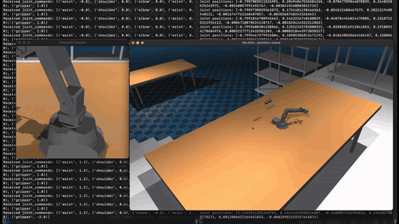

<div align="center">

# ros-examples

### ROS 2 robot examples with MuJoCo and Gazebo

**[Eric Plaß](https://github.com/erelbng)**

HTWK Leipzig

<p>
    <a href="https://erelbng.github.io/ros-examples/" target="_blank"></a>
    <a href="https://github.com/erelbng/mujoco-examples" target="_blank"></a>
    <a href="LICENSE"></a>
</p>
<p>
    
    
    
    
</p>

</div>

---

**ros-examples** collects ROS 2 packages for four robots: a minimal differential-drive robot in **Gazebo**, the same robot in **MuJoCo**, a **TurtleBot 4** and a **PincherX 100** manipulator. The MuJoCo packages run the physics inside a ROS node and publish standard topics, so they work with `rviz2`, `teleop_twist_keyboard` and `ros2 topic`.

For the same robots without ROS, see [mujoco-examples](https://github.com/erelbng/mujoco-examples). It runs directly in Python, **Windows included**.

---

## Demos

<table>
  <tr>
    <th width="50%">TurtleBot 4: driving with <code>cmd_vel</code></th>
    <th width="50%">PincherX 100: pick &amp; place</th>
  </tr>
  <tr>
    <td><a href="https://erelbng.github.io/ros-examples/#demos"></a></td>
    <td><a href="https://erelbng.github.io/ros-examples/#demos"></a></td>
  </tr>
</table>

Full-resolution videos: [`tb4_sim.mp4`](docs/assets/tb4_sim.mp4) · [`pincherx_sim.mp4`](docs/assets/pincherx_sim.mp4)

---

## Examples

### [diffbot](diffbot)
An introductory example based on [articubot_one](https://github.com/joshnewans/articubot_one) that implements a simple differential-drive robot with *ros2_control*, *Ignition Gazebo* and *rviz2*. Works on *Linux/Ubuntu* only.

```bash
ros2 launch diffbot launch_sim.launch.py
ros2 run teleop_twist_keyboard teleop_twist_keyboard --ros-args -p stamped:=true -r /cmd_vel:=/diff_cont/cmd_vel
```

### [diffbot_universal](diffbot_universal)
The diffbot, but with its own control implementation and a *MuJoCo* simulator that runs on more than one OS.

| Subscribes | Publishes |
|---|---|
| `/cmd_vel` | `/joint_states`, `/odom`, `/tf` |

### [turtlebot](turtlebot)
A [TurtleBot 4](https://clearpathrobotics.com/turtlebot-4/) implementation in ROS using *MuJoCo* and *OpenCV*. It publishes IMU, odometry and camera topics for *data science* and *computer vision*.

| Subscribes | Publishes |
|---|---|
| `/cmd_vel` | `/camera`, `/imu`, `/joint_states`, `/odom`, `/tf` |

### [pincherx](pincherx)
A compact manipulator arm ([PincherX 100](https://www.trossenrobotics.com/pincherx100)), implemented in ROS using *MuJoCo* and *OpenCV*. Use it for teleoperation, pick-and-place and similar tasks.

| Subscribes | Publishes |
|---|---|
| `/joint_commands` | `/camera`, `/joint_states` |

```bash
ros2 topic pub /joint_commands sensor_msgs/JointState "
header:
  stamp: {sec: 0, nanosec: 0}
name: ['waist', 'shoulder', 'elbow', 'wrist', 'gripper']
position: [0.0, 0.6, -0.8, 0.4, 0.2]
velocity: []
effort: []
" -1
```

---

## Quick Start

```bash
# Clone into a colcon workspace and build
mkdir -p ~/ros2_ws/src && cd ~/ros2_ws/src
git clone https://github.com/erelbng/ros-examples.git
cd ~/ros2_ws
colcon build
source install/local_setup.sh

# Terminal 1: start a simulation
ros2 launch turtlebot launch_sim.launch.py

# Terminal 2: drive it with the keyboard
ros2 run teleop_twist_keyboard teleop_twist_keyboard
```

Watch the topics with `ros2 topic echo /imu`, or open `rviz2` for the camera image. See each package's README for its dependencies.

---

## BibTeX

```bibtex
@misc{ros2025examples,
  author = {Eric Elbing},
  title  = {ros-examples},
  month  = {October},
  year   = {2025},
  url    = {https://github.com/erelbng/ros-examples}
}
```

## Contact
For technical support and other questions, contact [eric.elbing@htwk-leipzig.de](mailto:eric.elbing@htwk-leipzig.de).
